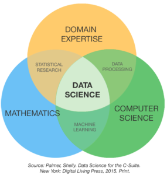

# Data-Science-Resources
An expansive collection of free Data Science Resources.

# What do I need to know?
I believe there are three main topics that make a great data scientist: Programming, Mathematics/Statistics, and Domain Knowledge.

## Programming
The first thing that comes to most minds when data science is mentioned is coding. Below is a list of resources that I use and have seen voiced in the community.

## Websites
https://www.geeksforgeeks.org/

## Mathematics
While you can do a fair bit of data science and analysis without math, you will ultimately come to a point where you find it important to have a strong grasp on some critical areas of math. Among these areas are algebra, calculus, probability, and statistics. Besides that, it can only be more helpful to pursue other aspects of math to further your analytical mind. Below are some resources including books, videos, and articles to help you.

### Books
https://www.amazon.com/shop/themathsorcerer/list/38XPHUJA75VTM?linkCode=spc&tag=themathsorc0e-20&domainId=influencer&asc_contentid=amzn1.ideas.38XPHUJA75VTM

### Videos
Among my favorite math youtube channels is The Math Sorcerer.
https://www.youtube.com/watch?v=fb_v5Bc8PSk&ab_channel=TheMathSorcerer
This is a video on a complete guide on how to self study math that includes many of the book recommendations above.
https://www.youtube.com/watch?v=OmJ-4B-mS-Y&t=391s&ab_channel=DomainofScience

### Articles
https://medium.com/math-simplified/self-studying-mathematics-abd99ff1f6bf

# Expansive Resources
This collection was inspired by this collection of works compiled here:
https://github.com/sindresorhus/awesome
